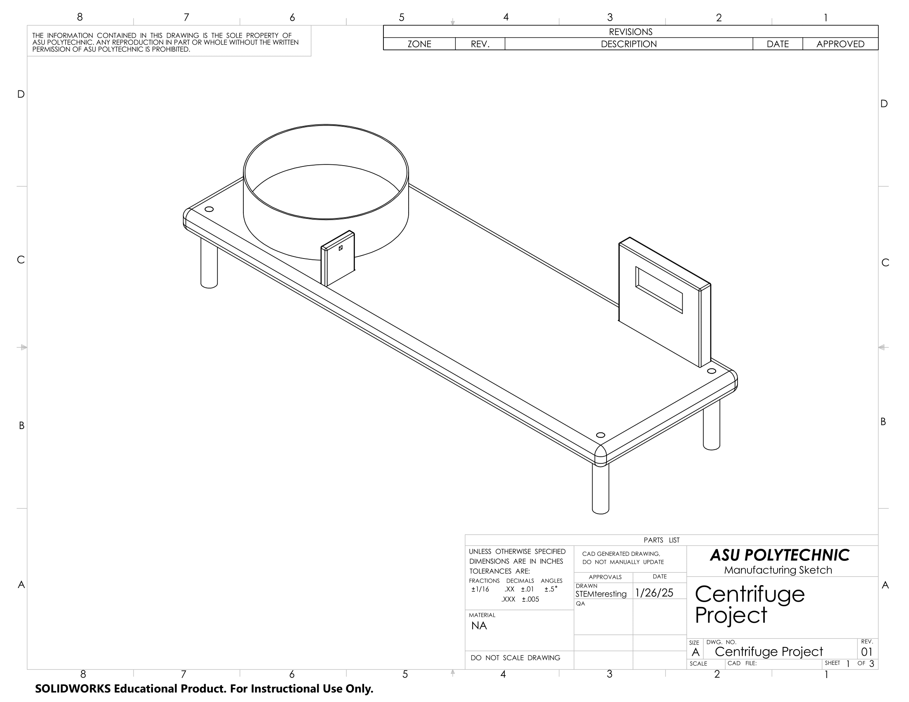
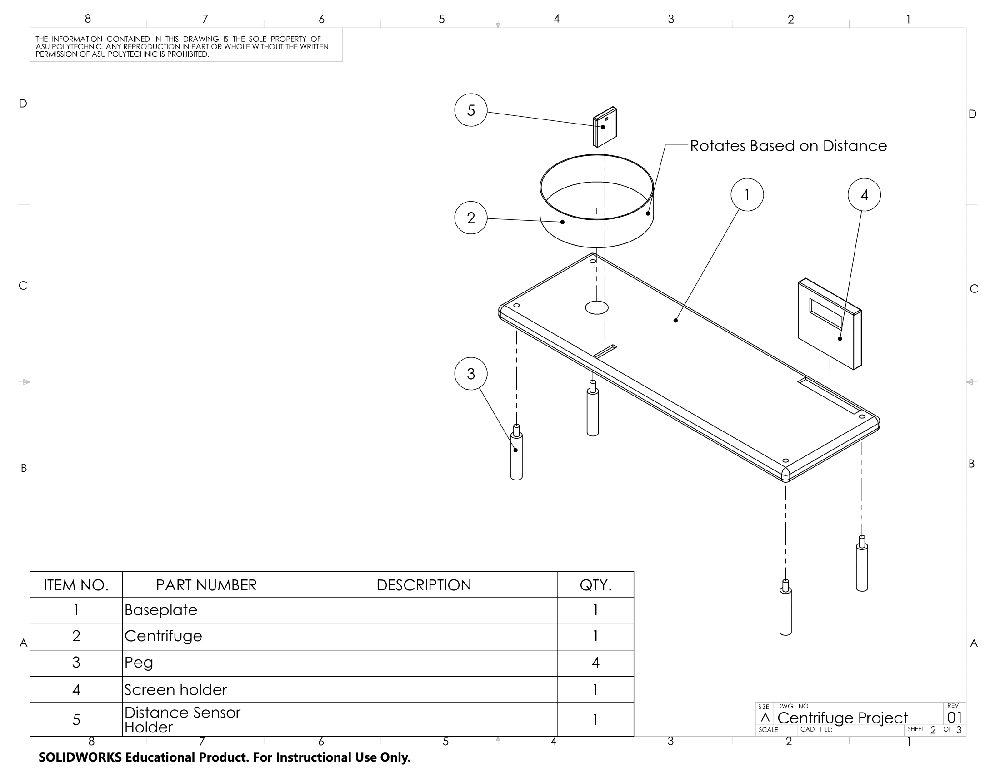

# Our Exhibit
The goal of our exhibit is to let people learn concepts through a demonstration of some type of STEM topic. We have determined that these topics must be related to something that these people have already been exposed to or will be. For example an exhibit of induction to children would be out of place but an exhibit of the color spectrum would be appropriate. The exhibit should also be interactive so that learning the concept or topic would be made easier. We don't want to make something that will just be stared at by an audience. We feel that having a user change variables will insure a higher change of a person learning the topic or concept displayed. 

Our audience will be 4th to 8th graders, as students in this age range are old enough to be trusted around more devices than children under this age range. Categorizing these students by grade also allows the team to understand what topics are appropriate for the age. The state of Arizona has standards for these grade levels, which can help inform what topics will be too advanced or too juvenile for our audience. 
## Preliminary research
In the article, “[Ideation in Practice: How Effective UX Teams Generate Ideas](https://www.nngroup.com/articles/ideation-in-practice/)”, one of the things that can be challenging during the ideation process is a lack of user research. This is usually due to a lack of time for the ideation process. While our team did experience a time crunch during the ideation process, research was still done to give ourselves a basis for generating ideas.

Our team did preliminary research before generating ideas for 4th-8th graders. To do this, we found it necessary to research what children were learning in the STEM field. Each STEM field has its subcategories. In the science field, there is life science, physical science, and space/earth science. We found these subcategories and then sorted them into a table. Then for each of these subcategories we found topics relating to them. We made sure that these topics are plausible for 4th-8th graders to learn and that they have some concept of it before viewing/interacting with the project. From these topics we were able to then create ideas for a project.  

### Topics for 4th-8th Graders

## Design Concept Sketch
Our team has decided to demonstrate that gravity can be mimicked using a centrifuge in an interactive science exhibit geared towards fourth to eighth grade students. Even though this is not explicitly a standard topic for the grade level, exposing a student to this concept could ignite their curiosity and make them more interested in related topics in the future. The exhibit will feature a centrifuge that is driven by a motor. The speed of the motor depends on what planet the student selects. The student selects the planet by placing their hands on a mat that shows the planets. A distance sensor will measure how far away their hand is. This data will be communicated with the motor and an OLED screen through the micro controllers. The OLED screen will print out the name of the planet the student has selected. The name of the planet will be sent to the user’s phone through internet communication. If the user presses a button, the OLED screen will display a fact about the current planet. The student using the machine will be given a small piece of clay that they can shape. Once it is their turn to use the machine, their clay is placed on the edge of the machine. When they select their gravity, the machine will spin, squishing their clay figure. The student will get to keep their clay figure once the demonstration is over. A concept design can be seen in Fig.1 and an exploded view in Fig.2 with labeled parts.

### Fig.1 Centrifuge Concept

### Fig.2 Exploded View of Centrifuge Concept

Users will be provided with written instructions and illustrations to guide them through how to interact with the exhibit. These will be printed on the exhibit near the feature that they pertain to in order to ensure that the user sees the instructions and understands how to safely operate the machine. There will be a warning about the centrifuge spinning at high speeds to keep the user from behaving dangerously around the machine. Where appropriate, team members will guide the audience through the demonstration prompts. Users will be asked to “choose their planet” to model their selected acceleration value. Users will identify their planet of choice in the marked location relative to their chosen planet’s distance from the sun. The use of a distance sensor ensures users are a safe distance from rotating components to initiate simulation by requiring that at least one of their hands be significantly far from the centrifuge.
The speed will be controlled by the distance sensor. The student will place one of their hands on a print-out that depicts a selection of planets. The user will place their hand on one of the planets. The distance sensor will read how far away the hand is and cause the motor to spin at the appropriate RPM for the selection. The HMI requirement asks us to allow users to see the sensor data and edit the setpoints for the demo. This would not be a feature that a fourth to eighth grader should have access to, as they could set certain values to dangerously high or low numbers and it is not necessary for the demonstration. This feature would only be used by demonstrators (i.e. teachers, developers, and museum employees) in case they want to change any of the values or diagnose potential issues with the device. 
The demo will have the following safety features to ensure that no one gets hurt while interacting with the machine. The centrifuge will be securely mounted and any contents will be sealed in the centrifuge while it is on. This is to ensure that nothing flies out of the machine, potentially injuring people. Users will have to keep at least one hand far away from the machine in order to use the controls. If no hand is present, the machine will not spin. Students and users with long hair will be instructed that their hair must be tied up and secured to keep it from getting caught in the machine. Users will be instructed and warned to not stand too close to the centrifuge. 
This exhibit can be split up into four subsystems. All of these subsystems would have some type of microcontroller and these controllers would communicate to each other via serial communication. The first subsystem would be a motor connected to an IC. The second subsystem would be the digital distance sensor that uses serial communion. Another would be a human interface for de-bugging. It will also be used for displaying information to the 4th-8th grader. Lastly, there would be a subsystem that sends information via the internet to a user and they could also send information back to the microcontroller. These subsystems would be split up among each member of STEMtresting. 
